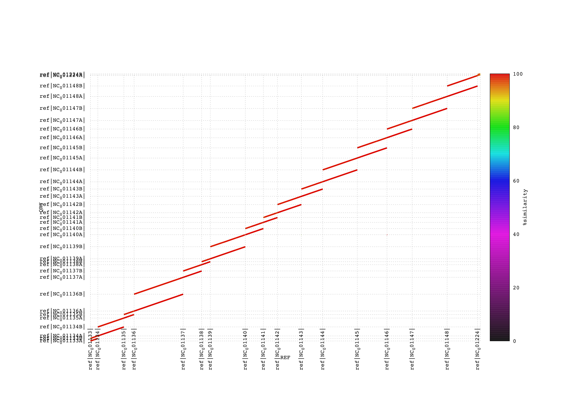

# phasing_workflow

## Getting the pipeline 
git clone git@github.com:sigau/proto_phasing_workflow-.git

******************

## Required system
The pipeline has been test on Ubuntu 16.04 and 18.04.

******************

## Software installation and dependencies 
### dependencies 
    - conda : https://docs.continuum.io/anaconda/install/linux/
    - pdflatex : sudo apt-get install texlive-latex-base texlive-fonts-recommended texlive-fonts-extra texlive-latex-extra  (if pdflatex not install add -P option in rule vcf_stats )
    - Firefox : for reading html
    - Gnuplot : https://sourceforge.net/projects/gnuplot/files/gnuplot/5.2.8/

### Software installation 
Most software dependecies are managed using **`conda`** and are contained in the environement.yaml file.

    - cd proto_phasing_workflow-
    - conda env create --name phasing-pipeline --file environment.yaml 
    - conda activate phasing-pipeline 
    - conda deactivate (when you have finish)

******************

## Usage 
### BAE: Before Anything Else
    - put your reference geneome in fasta in the data/genome folder
    - put your short-reads in fastQ/fastQ.gz in the data/short-reads folder
    - put your long-reads in fastQ/fastQ.gz in the data/long-reads folder

### Quality control
If you haven't done the quality control on your reads you can ask the pipeline to do it with the **QC** command like :

    - For quality control of **only the short-reads** : snakemake QC_SR -j 10 
    - For quality control of **only the long-reads** : snakemake QC_LR -j 10 
    - For quality control on **both** : snakemake QC -j 10

### Phasing with SR + LR + reference genome
Once your quality control are ok you can use the pipeline with 

    - snakemake all -j 10

******************
## results
At the end of the pipeline you obtain a fasta file of the two haplotype and a graph of the two haplotype against the reference geneome:

******************
## Directed Acyclic Graph (DAG) of the pipeline

******************
## directory tree structure
After the pipeline finish you directory tree structure should look like the one in the tree.txt :

    